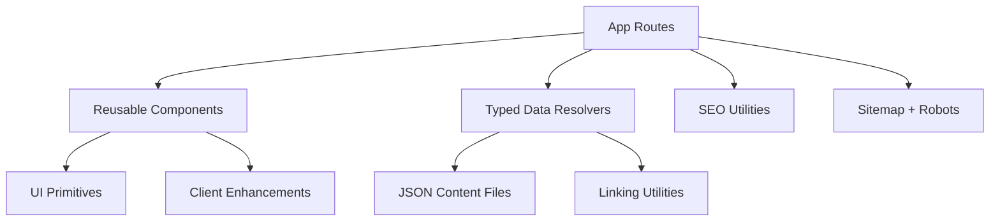
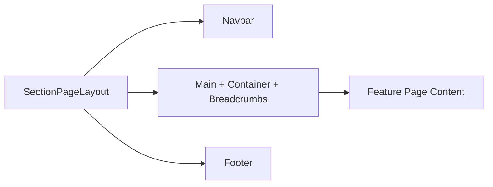
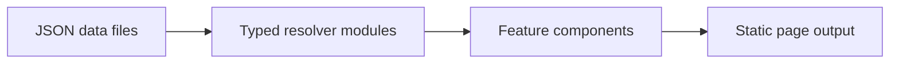

# Rakesh Kumar Agrawal Portfolio

Research and engineering profile built with Next.js App Router and exported as a static site for GitHub Pages.

Public URL:
https://rakeshkumaragrawal.github.io

## Tech Stack

- Next.js 16 (App Router, static export)
- React 19 + TypeScript (strict mode)
- Tailwind CSS v4
- Framer Motion
- Fuse.js (global search)
- React Force Graph (knowledge graph)
- Vitest (unit testing)

## Architecture



### Route Composition Model



### Data Flow Model



## Repository Structure

- `src/app`: route handlers and page composition
- `src/components`: UI and feature components
- `src/data`: JSON-first content and resolver models
- `src/lib`: reusable utilities (SEO, theme, linking)
- `src/test`: test setup
- `docs`: architecture, contributing, and performance notes

## Local Development

```bash
npm install
npm run dev
```

## Quality Commands

```bash
npm run lint
npm run test
npm run build
```

Optional coverage report:

```bash
npm run test:coverage
```

## Performance and Accessibility Highlights

- Global client enhancements are deferred until browser idle.
- Loading skeletons are provided for root and dynamic detail routes.
- Animations respect reduced-motion preferences.
- Global search supports keyboard navigation and listbox semantics.
- Theme preference is applied before hydration to avoid flash.

## Content Strategy

- Primary content is stored in JSON and mapped through typed resolver modules.
- Additional structured documentation is stored in Markdown under `docs`.
- Home section copy is centralized in `src/data/homeContent.json`.

## SEO Strategy

- Shared metadata helper ensures consistent canonical, OG, and Twitter metadata.
- Structured data (JSON-LD) is injected from root layout.
- Static `sitemap.xml` and `robots.txt` are generated from App Router routes.

## Deployment

This repository uses GitHub Actions for Pages deployment from static export output.

Key static-export settings:

- `output: "export"`
- `trailingSlash: true`
- `images.unoptimized: true` (GitHub Pages compatibility)

## Contribution Guidelines

1. Create a branch from `main`.
2. Keep PR scope focused and include validation output.
3. Preserve visual branding and existing user-facing behavior.
4. Prefer reusable components and typed data utilities over ad hoc code.
5. Keep content in JSON/Markdown when practical.

Before opening a PR, run:

1. `npm run lint`
2. `npm run test`
3. `npm run build`

## Additional Documentation

- `docs/architecture.md`
- `docs/contributing.md`
- `docs/performance-seo.md`

## License

MIT (see `LICENSE`).
